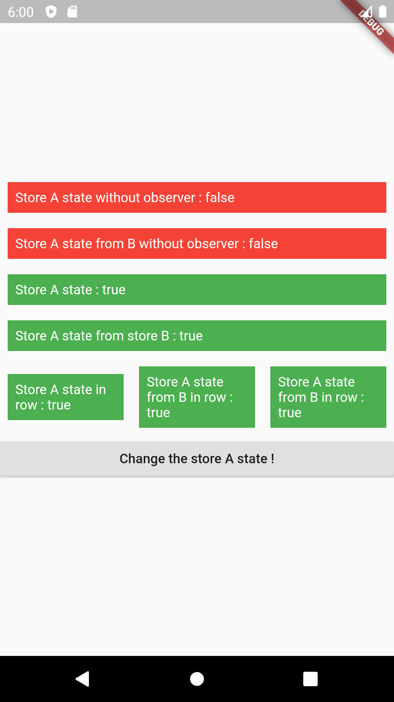

# mobx_experimentation

A project to play with the [mobX](https://mobx.netlify.com/getting-started) package.

This project aims to experiment when there are dependencies between different Stores. A simple example is :
```dart
abstract class _StoreA with Store {
  @observable
  bool state = false;

  @action
  void switchState() {
    state = !state;
  }
}

abstract class _StoreB with Store {
  _StoreB({@required StoreA storeA}) : _storeA = storeA;

  final StoreA _storeA;

  @computed
  bool get storeAState => _storeA.state;
}
```

It helps to understand the concept of @computed even if the observable comes from an other store.
There are logs in the view to see which part of the code is rebuilt when the observables change.




