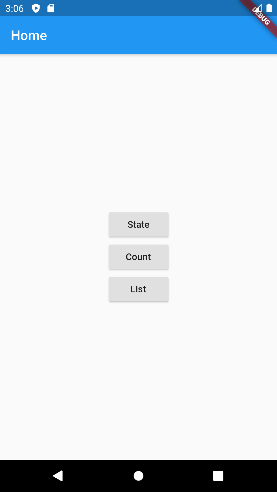

# mobx_experimentation

A project to play with the [mobX](https://mobx.netlify.com/getting-started) package.

This project aims to experiment when there are dependencies between different Stores.
It helps to understand the concept of @computed even if the observable comes from an other store.
The behavior between observableList and reaction is tested.
There are logs in the view to see which part of the code is rebuilt when the observables change.





# State


```dart
abstract class _StateA with Store {
  @observable
  bool state = false;

  @action
  void switchState() {
    state = !state;
  }
}

abstract class _StateA with Store {
  _StateA({@required StateA stateA}) : _stateA = stateA;

  final StateA _stateA;

  @computed
  bool get stateAState => _stateA.state;
}
```

# Count


```dart
class CountStore = _CountStore with _$CountStore;

abstract class _CountStore with Store {
  @observable
  int count = 0;

  @action
  void increment() {
    count++;
  }

  String get countString => 'Total without computed : $count';

  @computed
  String get computedCountString => 'Computed total : $count';

  Color get color {
    if (count > 10) {
      return Colors.red;
    } else {
      return Colors.green;
    }
  }

  @computed
  Color get computedColor {
    if (count > 10) {
      return Colors.red;
    } else {
      return Colors.green;
    }
  }
}
```

# List


```dart
class ListStore = _ListStore with _$ListStore;

abstract class _ListStore with Store {
  @observable
  List<String> list = [];

  @observable
  ObservableList<String> observableList = ObservableList.of([]);

  @action
  void addItem(String item) {
    list = [
      ...list,
      item,
    ];
    observableList.add(item);
  }
}

class ReactionStore extends _ReactionStore with _$ReactionStore {
  ReactionStore({@required ListStore listStore}) : super(listStore: listStore);
}

abstract class _ReactionStore with Store {
  _ReactionStore({@required ListStore listStore}) : _listStore = listStore {
    _reactionListDisposer = reaction<List<String>>(
      (_) => _listStore.list,
      updateCount,
      fireImmediately: true,
    );
    _reactionObservableListDisposer = reaction<List<String>>(
      (_) => _listStore.observableList,
      updateCount,
      fireImmediately: true,
    );
  }

  ReactionDisposer _reactionListDisposer;
  ReactionDisposer _reactionObservableListDisposer;

  final ListStore _listStore;

  @observable
  int listCount;

  @observable
  int observableListCount;

  @computed
  int get computedListCount => _listStore.list.length;

  @computed
  int get computedObservableListCount => _listStore.list.length;

  void updateCount(List<String> list) {
    listCount = list.length;
  }

  void updateObservableListCount(List<String> observableList) {
    observableListCount = observableList.length;
  }

  void dispose() {
    _reactionListDisposer();
    _reactionObservableListDisposer();
  }
}
```


